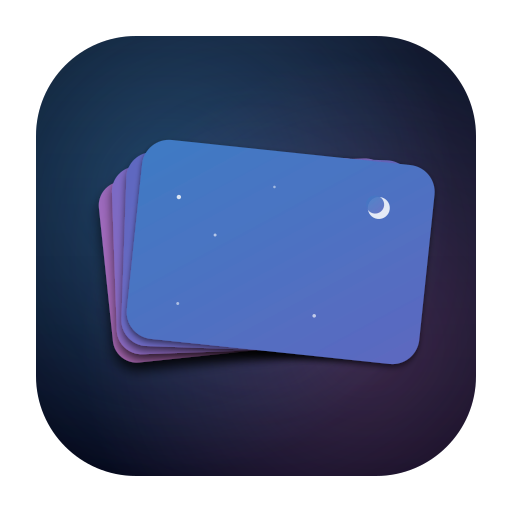
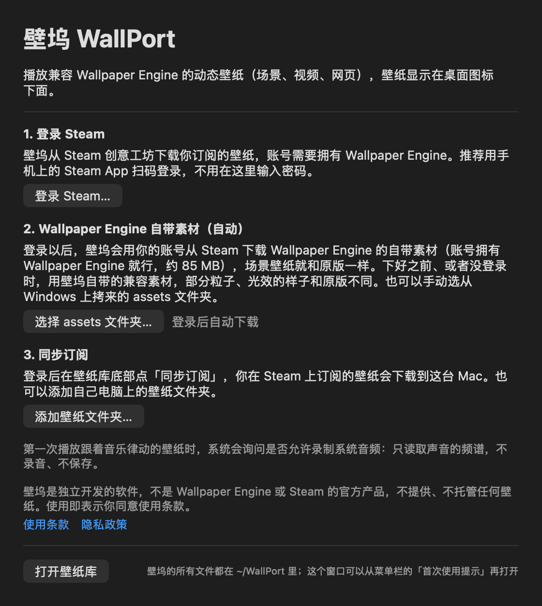
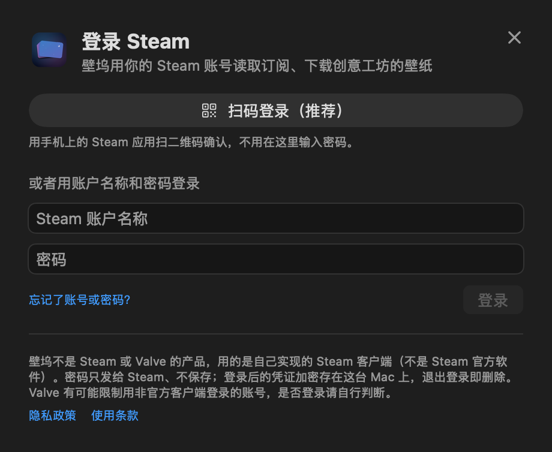

<div align="center">



# WallPort

**Wallpaper Engine live wallpapers on your Mac**

Scene · Video · Web &nbsp;|&nbsp; Native on Apple silicon &nbsp;|&nbsp; Free and open source

<a href="../../releases/latest"></a>

<a href="../../releases/latest"></a>
<a href="../../releases"></a>


<a href="LICENSE"></a>

[**中文**](README.md) &nbsp;·&nbsp; [Install](#install) &nbsp;·&nbsp; [FAQ](#faq) &nbsp;·&nbsp; [Privacy](#privacy) &nbsp;·&nbsp; [Build from source](#build)

</div>

<br>

> [!IMPORTANT]
> WallPort is independent open-source software. It is **not an official Wallpaper Engine product** and is not affiliated with Wallpaper Engine, Steam, Valve or their developers.
> WallPort does not provide or host any wallpapers and does not include Wallpaper Engine's assets — wallpapers come from your own Steam Workshop subscriptions and belong to their authors.

## ✨ Features

<table>
<tr>
<td width="50%" valign="top">

**🖼️ All three kinds of wallpapers**<br>
Scene wallpapers with layers, effects, particles, puppet animation, text and clocks, scripts and sound — plus video and web wallpapers. Wallpaper Engine's shaders are translated to Metal at runtime.

</td>
<td width="50%" valign="top">

**🔄 Your subscriptions, synced**<br>
Sign in to Steam with a QR code and the wallpapers you subscribe to in the Workshop download to your Mac. You can also browse and subscribe right in the app.

</td>
</tr>
<tr>
<td valign="top">

**🎨 Looks like the original**<br>
After you sign in, WallPort downloads Wallpaper Engine's built-in assets from Steam with your own account — no copying files from a Windows PC.

</td>
<td valign="top">

**🖥️ Multiple displays and rotation**<br>
A different wallpaper on each display, with optional rotation. The colors, switches and sliders wallpaper authors provide can be adjusted directly.

</td>
</tr>
<tr>
<td valign="top">

**🔋 Saves power**<br>
Lowers the frame rate or pauses when the desktop is covered, on battery or when your Mac runs hot; slow-moving scenes drop to 20 or 24 fps automatically.

</td>
<td valign="top">

**🌙 Stays out of the way**<br>
Lives in the menu bar; displays without a wallpaper keep your own desktop picture; the lock screen shows the current frame, and everything is restored when you quit.

</td>
</tr>
</table>

## 📸 Screenshots

<p align="center">
  
  
</p>
<p align="center"><sub>Screenshots show the Chinese interface; WallPort is in English on non-Chinese systems.</sub></p>

<a id="install"></a>
## 📥 Install

- 💻 **System**: macOS 14.6 or later
- 🍎 **Chip**: Apple silicon (M1 or later); Intel Macs are not supported
- 🎮 **Account**: a Steam account that owns Wallpaper Engine, to download from the Workshop
- 🧠 **Memory**: 16 GB recommended (effect-heavy scenes can use about 1 GB on a 4K display)

1. Download `WallPort-<version>.dmg` from [**Releases**](../../releases/latest);
2. open the .dmg, drag **WallPort** into Applications and open it from there (not from inside the .dmg);
3. WallPort appears in the menu bar at the top right. Follow the welcome window — sign in to Steam with the QR code, let the assets download, sync your subscriptions — then pick wallpapers in the Library.

> [!TIP]
> **macOS says the developer cannot be verified?** That happens with builds not signed with an Apple Developer ID (each release says whether it is signed).
> After making sure you downloaded it from this repository's Releases, open System Settings → Privacy & Security, find WallPort near the bottom and click "Open Anyway".
> To verify the download: `shasum -a 256 -c WallPort-<version>.dmg.sha256` (the checksum file is in the same release).

**Updates**: WallPort checks for a new version once a day, downloads and verifies it in the background (checksum, bundle ID, version and code signature), then asks whether to **Update Now** (relaunches; wallpapers pause for a second or two) or **Update When Quitting**. You can turn off "Check for Updates Automatically" and "Download Updates Automatically" in the menu bar menu. If WallPort was opened straight from the disk image, or can't write to Applications, it asks you to download the new .dmg and replace it by hand. Your settings and wallpapers are kept.

<a id="faq"></a>
## ❓ FAQ

<details>
<summary><b>Why sign in to Steam? Is it safe?</b></summary>
<br>

Downloading from the Workshop and downloading Wallpaper Engine's built-in assets both use your Steam account. Signing in with the **QR code** is recommended: you confirm in the Steam app on your phone and never type your password into WallPort.
WallPort never stores your password; the sign-in credential is stored encrypted on your Mac and deleted when you sign out.

WallPort uses its own implementation of the Steam client, not the official Steam app, and Valve may restrict accounts that sign in this way — please decide for yourself.
</details>

<details>
<summary><b>What are "Wallpaper Engine's built-in assets"? Do I need to get them myself?</b></summary>
<br>

No. Scene wallpapers use shaders, textures and other assets that ship with Wallpaper Engine. After you sign in, WallPort uses **your** Steam account to download these files from the copy of Wallpaper Engine you own (about 85 MB, updated automatically when Wallpaper Engine updates), so scenes look the same as in Wallpaper Engine.

WallPort itself does not include or distribute these assets (they are Wallpaper Engine's copyrighted content). Until they are downloaded, or without signing in, WallPort uses its own compatible assets, and some particles and light effects look different.
</details>

<details>
<summary><b>Which wallpapers work?</b></summary>
<br>

Scene, video and web wallpapers. "Application" wallpapers are Windows programs and cannot run on macOS. Of the 329 scenes on the development machine, 313 (95%) are judged normal; the rest use a few effects that are not implemented yet (layers with a 3D camera, HDR bloom, ...), so those parts look different from the original. See [docs/M6-验收清单.md](docs/M6-验收清单.md) for the criteria and what is missing.
</details>

<details>
<summary><b>What happens to my desktop before I pick a wallpaper?</b></summary>
<br>

Nothing. Displays without a wallpaper keep your own desktop picture; you can also choose "No Live Wallpaper (Use System Wallpaper)" for a display in the menu bar menu.
</details>

<details>
<summary><b>Why can't I see Questionable or Mature wallpapers in the Workshop?</b></summary>
<br>

Browsing the Workshop shows only Everyone-rated items by default; the first time you tick the other ratings you are asked to confirm that you are at least 18.
</details>

<details>
<summary><b>How do I uninstall it?</b></summary>
<br>

Quit WallPort (menu bar icon → Quit — this restores your original desktop picture), then move the `WallPort` folder in your home folder and WallPort in Applications to the Trash. Everything WallPort keeps is in `~/WallPort`.
</details>

<details>
<summary><b>Something went wrong — how do I report it?</b></summary>
<br>

Open an [issue](../../issues). In the Library, choose Help → Export Diagnostics… and attach the zip (your Steam account name and user name are removed).
**Please don't upload wallpaper files or Wallpaper Engine assets** (they are copyrighted) — the Workshop ID is enough.
</details>

<a id="privacy"></a>
## 🔒 Privacy

WallPort **collects no personal information and sends nothing to its developer** — no analytics, no ads, no automatic reports.

- Settings, wallpapers, the (encrypted) sign-in credential, caches and logs stay on your Mac in `~/WallPort`;
- it connects only to **Steam** (sign-in, subscriptions, downloading wallpapers and assets, browsing the Workshop), **GitHub** (a daily update check and update downloads, both of which you can turn off), and whatever sites web wallpapers load (you can block that in the menu);
- system audio is read only while a music-reactive wallpaper plays, as a spectrum — nothing is recorded or saved; to pause when the desktop is covered, WallPort reads the positions of on-screen windows (never their contents or titles).

The full [Privacy Policy](App/Legal/Privacy.html) and [Terms of Use](App/Legal/Terms.html) are available from the app's Help menu and welcome window.

<a id="build"></a>
## 🛠️ Build from source

Requires macOS 14.6 or later, Apple silicon and Xcode (Swift 6). The sources of glslang, SPIRV-Cross and the zstd decompressor are in `Vendor/` and build with the project — nothing else to install.

```bash
swift test                 # run the tests
scripts/build-app.sh       # build the app into ~/WallPort/WallPort.app (quits a running WallPort first)
open ~/WallPort/WallPort.app
```

Releases are built with `scripts/release.sh` (signing, plus notarization when you have an Apple Developer ID) and published with `scripts/publish-github.sh`; see the notes at the top of both scripts. Design notes are in [`docs/`](docs/) (in Chinese).

## 🤝 Contributing

Issues and pull requests are welcome. Please read [CONTRIBUTING.md](CONTRIBUTING.md) first. Two hard rules:
**never commit anything from Wallpaper Engine, and don't use GPL/AGPL implementations as references**; record the source of every new technique in [REFERENCES.md](REFERENCES.md).

## 📄 License

WallPort's source code is available under the [MIT License](LICENSE). Third-party code in `Vendor/` (glslang, SPIRV-Cross, zstd, LZMA SDK) and the fonts in `App/CompatFonts/` keep their own licenses, included next to them and in the app's About window.

"Wallpaper Engine" and "Steam" are trademarks of their respective owners.
